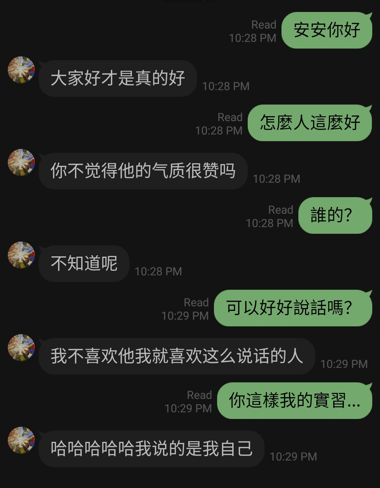
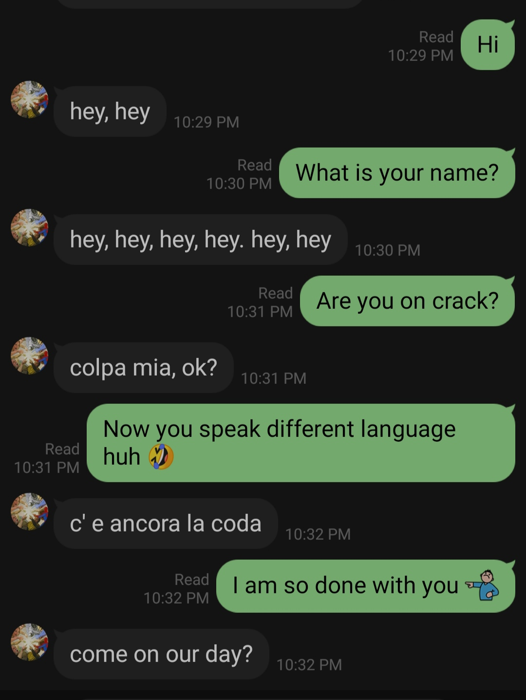
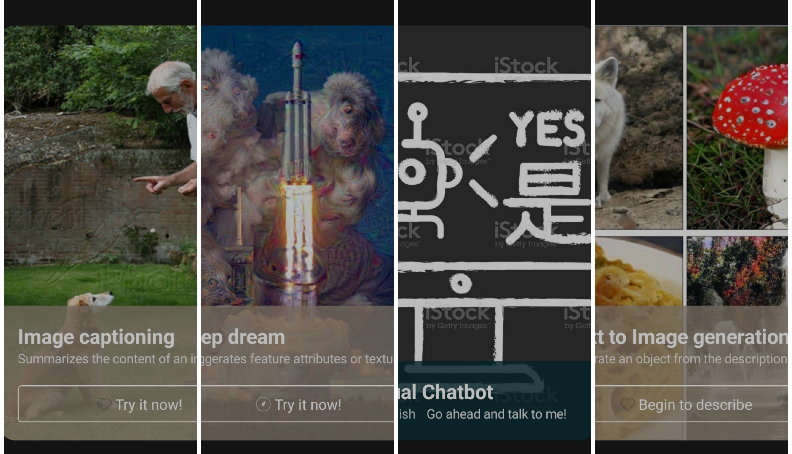
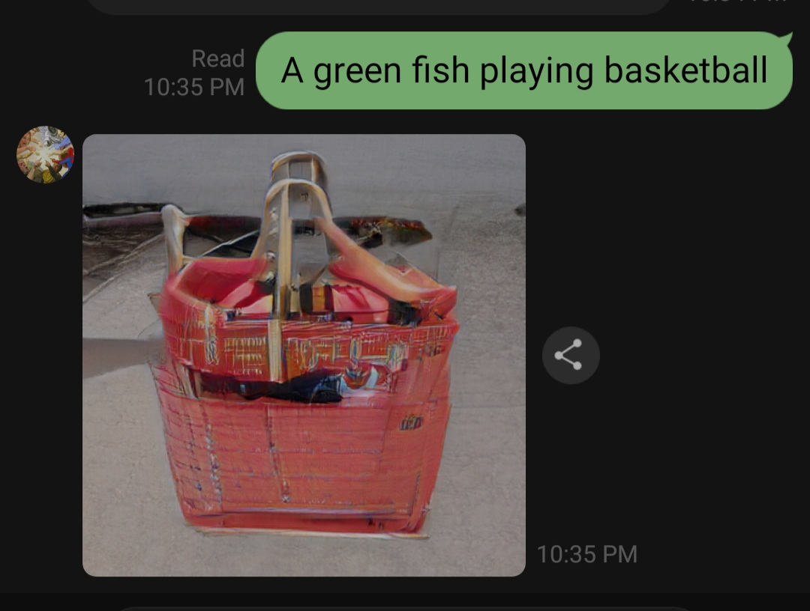
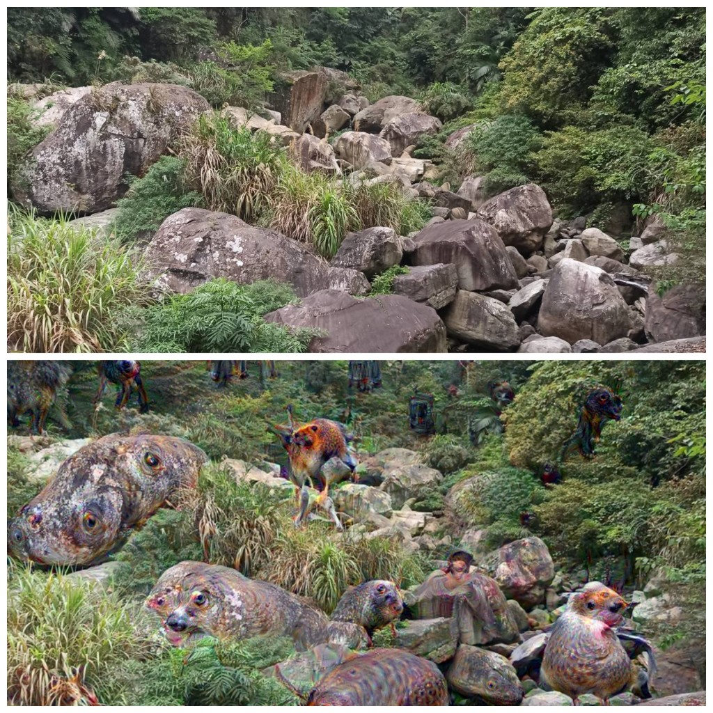
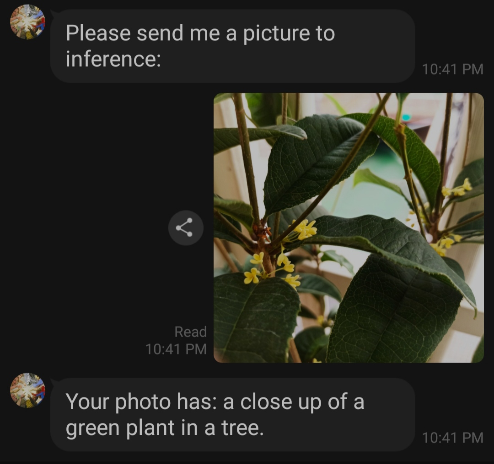

# Line's Chatbot Implementation with several NLP features 

## Project Description

This project is an attempt to understand and implement a Line's Chatbot  
The following functionalities were made:  
- GPT2-chitchat >(https://github.com/yangjianxin1/GPT2-chitchat)  
- meena-chatbot >(https://github.com/frankplus/meena-chatbot)  
- Txt2Img generation > DeepAI's API (https://deepai.org/machine-learning-model/text2img)  
- Deep_dream image generation>DeepAI's API (https://api.deepai.org/api/deepdream)  
- Image Captioning >DeepAI's API (https://api.deepai.org/api/neuraltalk)  

## Running Environment
- python3.6.13  
- transformers3.5.0  
- torch1.3.0, torchvision0.4.1  
- tensorflow1.15.5, tensorflow-datasets3.2.1, tensor2tensor  
- flask, line-bot-sdk  
- langdetect  

## Structure of Directory
- app.py: LineBot server  
- Flex.pickle: flex message  
- ch_chatbot: The model used for Chinese chitchat  
- meena: The model used for English chitchat  

## Demonstration
- Chinese/English Chitchat:  

- Overview of the flex messege  

- Txt2Img generation  

- Deep_dream image generation  

- Image Captioning  

## Future Work

## Reference
- [GPT2-chitchat](https://arxiv.org/pdf/1911.00536.pdf)  
- [meena-chatbot](https://arxiv.org/pdf/2001.09977.pdf)  
- [line-bot-sdk-python](https://github.com/line/line-bot-sdk-python)

